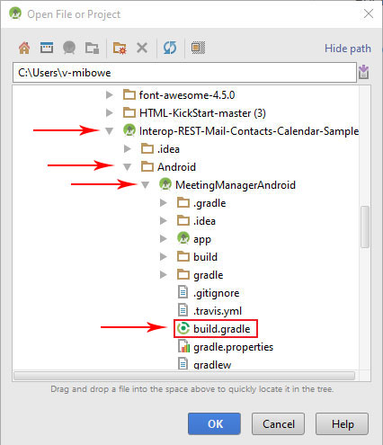
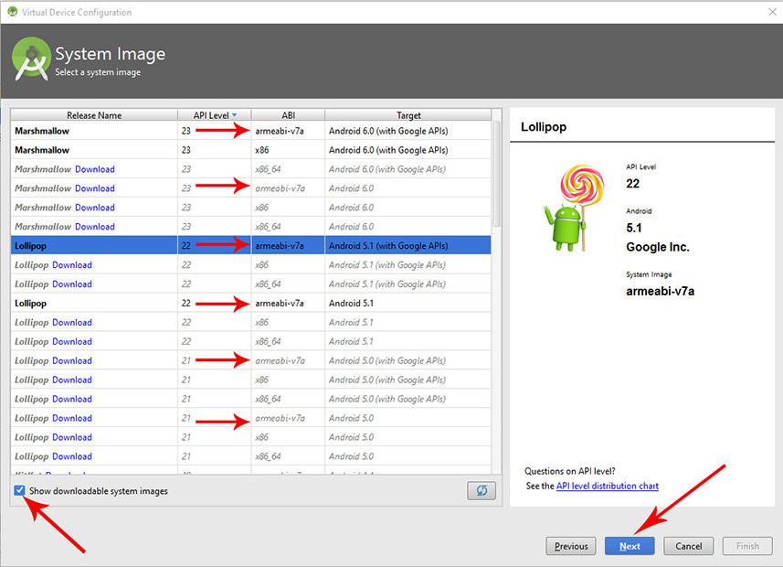

#Interop REST Mail Contacts Calendar App Android Configuration

Before you configure your app, you need to register your app with an Office 365 Developer account. The directions for registering are in the [README.md file in the root of this repo](../README.md). Once your app is registered, [install the Android SDK](#install-android-sdk) and you're ready to get started [configuring your app for Android](#android-configuration).

##Table of Contents

* [Install Android SDK](#install-android-sdk)

* [Android Configuration](#android-configuration)

* [Visual Studio Emulator Configuration](#visual-studio-emulator-configuration)

  * [Install Visual Studio Android Emulator](#install-visual-studio-android-emulator)

  * [Launch the App in Visual Studio Android Emulator](#launch-the-app-in-visual-studio-android-emulator)

###Install Android SDK

The Android SDK can be downloaded from the Android Developer site [here](http://developer.android.com/sdk/index.html). You may also need to install [JDK (Java SE Development Kit)](http://www.oracle.com/technetwork/java/javase/downloads/index.html). If you have questions about installing the Java SDK, you can refer to this [tutorial](http://www.wikihow.com/Install-the-Java-Software-Development-Kit).

For the full installation instructions visit [the Android Developer Website](http://developer.android.com/sdk/installing/index.html).

###Android Configuration

1. Download or clone [The Interop REST Mail Calendar Android App](https://github.com/OfficeDev/Interop-REST-Mail-Contacts-Calendar-Sample).

2. Start Android Studio

3. <a name="step3"/>Click on **Open an existing Android Studio project** and select the folder that contains the app, then open the "MeetingManagerAndroid" folder then the "Android" folder and select the build.gradle file.

  

  

4. Click **Run** > **Run 'app'** or click the green triangle play button. Please note, it can take several minutes to start the emulator and the app.

  

5. The first time you run the app you will need to add an ARM device to the emulator. To do this:  

  Click on the ellipsis (three dots in a row) next to the down arrow. 
  

  Click **Create Virtual Device** on the next menu.
  

  Choose a device with a resolution higher than 1200 X 800 and click **Next**
  

  Check **Show downloadable system images** and select an option with **armeabi-v7a** for ABI and click next. 
  

  Select the device you created and click the green arrow at the end of the line
  

6. The next time you start the app, you can skip step 5 and select a device by clicking the down arrow next to "Android virtual device:". To add more devices simply repeat step 5 for as many devices as you want to add.

 * If you get the error message: 
    ```
    emulator: ERROR: x86 emulation currently requires hardware acceleration!
    Please ensure Intel HAXM is properly installed and usable.
    CPU acceleration status: HAX kernel module is not installed!
    ```
  Refer to this [Stackoverflow question](http://stackoverflow.com/questions/26355645/error-in-launching-avd) for how to install HAXM

  

7. <a name="step7"/>Your app will now start in the emulator. But in order to connect the app to an account you first have to Register the app with Office 365 and copy your "CLIENT ID" and "REDIRECT URI". The directions for registering are in the [README.md file in the root of this repo](../README.md).

8. You can enter your "CLIENT ID" and "REDIRECT URI" by clicking on the three vertical dots in the upper right of the emulator screen and click **settings** and enter them there or navigate to **app** > **src/main** > **java** > **com/microsoft/office365/meetingmgr** > **Constants.java** and paste your "CLIENT ID" and "REDIRECT URI" as strings and save the file.

   |  | 
  --- | --- | ---

9. Click **CONNECT TO OFFICE 365** and the app will start. 

  

10. Your app is now ready for you to build with. Go create something awesome!

##Visual Studio Emulator Configuration

Android Studio comes with its own Android emulator, but Microsoft has designed an emulator focused on performance, speed, and efficiency that can be used independently or in conjunction with Visual Studio 2015. You can learn more about the Visual Studio Emulator for Android [here](https://channel9.msdn.com/Events/Visual-Studio/Connect-event-2014/516).

###Install Visual Studio Android Emulator

You can download and install the Visual Studio Emulator for Android [from this page](https://www.visualstudio.com/en-us/features/msft-android-emulator-vs.aspx). Then you can use it as a stand alone emulator or in conjunction with Visual Studio.

The Visual Studio Emulator for Android does not require you to download and/or use Visual Studio, but if you would like to use the free (Community) or paid (Enterprise) Visual Studio, you can download and install either version from the [Visual Studio Website](https://www.visualstudio.com/). Whichever version you choose, it must be Visual Studio 2015 in order to run the emulator.

###Launch the App in Visual Studio Android Emulator

There are two ways to launch the Visual Studio Android Emulator, as a stand-alone emulator and through Visual Studio. Which way you want to use the emulator determines how you start it, but after that the steps are the same.

####As a Stand-Alone Emulator

To launch the Visual Studio Android Emulator as a stand-alone emulator, click on the Start menu and search for "emulator" and select **Visual Studio Emulator for Android**


####As Part of Visual Studio

To launch the Visual Studio Android Emulator as part of Visual Studio, click on the Start menu and search for "Visual Studio" and click on **Visual Studio 2015**


---

1. Once the emulator has started, choose a device by clicking the green triangle next to your choice.
  
  

2. When you have chosen a device, open your project in Android Studio and start your app using steps [3 - 4 in the Android Configuration](#step3) section above.

3. After running your app, instead of choosing to launch the emulator, select **Choose a running device** and then select a device using the VS Emulator then click **OK**.
  
   

4. Your app will now open the connect page in the Visual Studio Emulator for Android. To login and use the app, complete steps [7 - 10 in the Android Configuration](#step7) section.

---

###Copyright

Copyright (c) 2016 Microsoft. All rights reserved.
