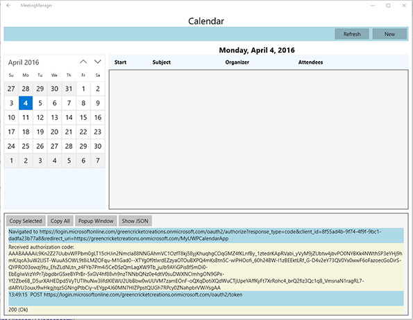
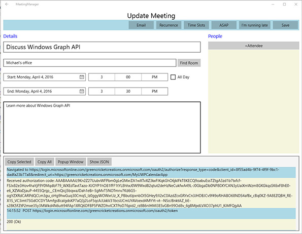
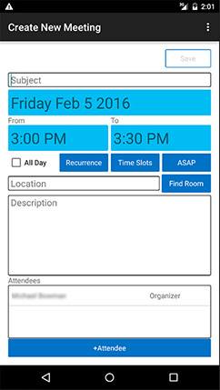
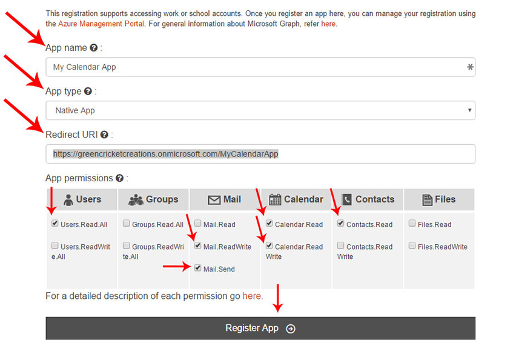

# Interop REST-App für E-Mail-Kontakte und Kalender

In diesem Projekt wurden die [Microsoft Open Source-Verhaltensregeln](https://opensource.microsoft.com/codeofconduct/) übernommen. Weitere Informationen finden Sie unter [Häufig gestellte Fragen zu Verhaltensregeln](https://opensource.microsoft.com/codeofconduct/faq/), oder richten Sie Ihre Fragen oder Kommentare an [opencode@microsoft.com](mailto:opencode@microsoft.com).

In dieser Beispiel-App wird der REST-Benutzeroberfläche (Representational State Transfer) für Office 365, einschließlich der Authentifizierung, der Interaktion mit dem Kalender, des Abfragen des Adressbuchs und des Sendens von E-Mails, veranschaulicht. Die App kann für Android und die universelle Windows-Plattform entwickelt werden. Als Erstes müssen Sie [Ihre App bei einem Office 365-Entwicklerkonto registrieren](#ihre-app-bei-einem-office-365-entwicklerkonto-registrieren) und dann die gewünschte Plattform auswählen. 

##Inhaltsverzeichnis

* [Informationen zur Interop REST-App für E-Mail-Kontakte und Kalender](#informationen-zur-interop-rest-app-für-e-mail-kontakte-und-kalender)

* [Registrieren der App bei einen Office 365-Entwicklerkonto](#registrieren-der-app-bei-einen-office-365-entwicklerkonto)

* Entwickeln der App

  * [Entwickeln der App für die universelle Windows-Plattform](/UWP)
  
  * [Erstellen der App für Android](/Android)

##Informationen zur Interop REST-App für E-Mail-Kontakte und Kalender

Nach der Anmeldung bei einem Office 365-Konto können Sie in der App Ihren Kalender anzeigen und einzelne oder regelmäßige Besprechungen in Ihrem Kalender erstellen. Besprechungen können mit einem bestimmten Ort, Zeitrahmen und einer Gruppe von eingeladenen Personen geplant werden, wobei die verfügbaren Orte und Teilnehmer von Office 365 abgefragt werden. Jede eingeladene Person hat die Option, die Besprechung zu akzeptieren, abzulehnen oder mit Vorbehalt zu akzeptieren oder dem Organisator eine E-Mail zu senden. Ein Organisator hat die Möglichkeit, allen zu antworten oder die Besprechungseinladung weiterzuleiten und an die eingeladenen Personen eine Nachricht zu schicken, wenn er zu spät kommt.

Wenn die App mit der universellen Windows-Plattform entwickelt wird, können Sie die Live-Anforderungen und -Antworten aus der Microsoft Graph Universal-API in einer Konsole am unteren Rand der App sehen.

Die Standard-App kann Folgendes:

####Anzeigen Ihres Kalenders

Android | UWP
--- | ---
 | 

####Anzeigen der Besprechungsdetails

Android | UWP
--- | ---
 | 

####Senden einer Nachricht an andere Teilnehmer der Besprechung

Android | UWP
--- | ---
 | 

####Ändern der Besprechungsdetails

Android | UWP
--- | ---
 | 

####Erstellen einer neuen Besprechung

Android | UWP
--- | ---
 | 

##Registrieren der App bei einen Office 365-Entwicklerkonto

1. Unabhängig davon, was Sie zum Konfigurieren der App verwenden, benötigen Sie ein Office 365-Entwicklerkonto, bei dem Sie die App registrieren. So registrieren Sie sich für ein Office 365 Entwicklerkonto:

  * [Nehmen Sie am Office 365 Entwicklerprogramm teil, und erhalten Sie ein kostenloses Abonnement für Office 365 für 1 Jahr](https://aka.ms/devprogramsignup).

  * Folgen Sie dem Link in der Bestätigungs-E-Mail, und erstellen Sie ein Office 365-Entwicklerkonto.

  * Ausführliche Anweisungen zum Registrieren für ein Entwicklerkonto finden Sie [hier](https://msdn.microsoft.com/en-us/library/office/fp179924.aspx#o365_signup).

2. Sobald Sie ein Office 365 Entwicklerkonto erstellt haben, wechseln Sie zu [graph.microsoft.io](http://graph.microsoft.io/en-us/), um Ihre App zu registrieren, und klicken Sie auf **App-Registrierung** und dann auf **Office 365-Tool für die App-Registrierung**. Sie können auch direkt zur Registrierungsseite [dev.office.com/app-registration](http://dev.office.com/app-registration) wechseln.

   

  

3. Geben Sie der App einen Namen, und wählen Sie **Systemeigene App** in der Zeile **App-Typ** aus. Wählen Sie dann einen Umleitungs-URI aus. Die bevorzugte Namenskonvention hierfür lautet: "Ihre Office 365-Domäne + ein eindeutiger Name für Ihre App". Dies ist jedoch nicht erforderlich, der Name muss aber als URI formatiert und eindeutig sein. Ich habe meiner App beispielsweise den Namen „https://greencricketcreations.onmicrosoft.com/MyCalendarApp“ gegeben. Der Umleitungs-URI ist keine echte Website. Es handelt sich vielmehr um einen eindeutigen Bezeichner für Ihre App. Nachdem Sie einen Namen und einen Umleitungs-URI eingegeben haben, legen Sie die Berechtigungen fest. Die erforderlichen Berechtigungen sind:

  * Benutzerprofile lesen
  * Benutzerkontakte lesen
  * Benutzerkalender lesen und schreiben
  * Benutzerkalender lesen
  * E-Mails als Benutzer senden
  * Benutzer-E-Mails lesen und schreiben

4. Nachdem Sie das Formular ausgefüllt haben, klicken Sie auf **App registrieren**.

  

5. Nach Abschluss der Registrierung erhalten Sie eine Client-ID. Notieren Sie sich die Client-ID und den Umleitungs-URI. Sie benötigen beides zum Konfigurieren der App.

6. Wenn Sie mehr Kontrolle über die Registrierungsoptionen benötigen, können Sie die nachstehenden [ausführlichen Anweisungen](https://github.com/jasonjoh/office365-azure-guides/blob/master/RegisterAnAppInAzure.md) befolgen, um die App in Azure zu registrieren. Beachten Sie, dass in diesen Anweisungen das klassische Azure-Portal verwendet wird. Sie können [hier auf das klassische Azure-Portal](https://manage.windowsazure.com/) zugreifen.

7. Jetzt können Sie Ihre App mit [Android](/Android) oder der [universellen Windows-Plattform](/UWP) oder mit beidem entwickeln!

---

###Copyright

Copyright (c) 2016 Microsoft. Alle Rechte vorbehalten.