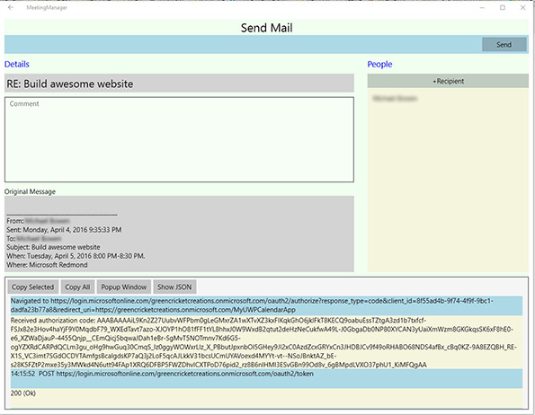

# Aplicación de calendario de los contactos del correo Interop REST

Este proyecto ha adoptado el [Microsoft Open Source Code of Conduct](https://opensource.microsoft.com/codeofconduct/) (Código de conducta de código abierto de Microsoft). Para obtener más información, consulte las [Code of Conduct FAQ](https://opensource.microsoft.com/codeofconduct/faq/) (Preguntas más frecuentes del código de conducta) o póngase en contacto con [opencode@microsoft.com](mailto:opencode@microsoft.com) con otras preguntas o comentarios.

Esta aplicación de ejemplo muestra la interfaz de Representational State Transfer (REST) para Office 365, incluida la autenticación, interactuando con el calendario, consultando la libreta de direcciones y enviando correo electrónico. La aplicación se puede crear para Android y la plataforma universal de Windows. Para comenzar, [registre la aplicación con una cuenta de Office 365 Developer](#registre-la-aplicación-con-una-cuenta-de-office-365-developer) y, después, seleccione qué plataforma o plataformas desea crear. 

##Tabla de contenido

* [Acerca de la aplicación de calendario de los contactos del correo Interop REST](#acerca-de-la-aplicación-de-calendario-de-los-contactos-del-correo-interop-rest)

* [Registrar la aplicación con una cuenta de Office 365 Developer](#registrar-la-aplicación-con-una-cuenta-de-office-365-developer)

* Crear la aplicación

  * [Crear la aplicación para la plataforma universal de Windows](/UWP)
  
  * [Crear la aplicación para Android](/Android)

##Acerca de la aplicación de calendario de los contactos del correo Interop REST

En la aplicación, después de iniciar sesión en una cuenta de Office 365, puede ver el calendario y crear reuniones únicas o periódicas en el calendario. Se pueden programar las reuniones con una ubicación determinada, intervalo de tiempo y un conjunto de invitados, donde se consultan los asistentes y las ubicaciones disponibles de Office 365. Cada invitado tiene la opción de aceptar, rechazar o aceptar provisionalmente una reunión, o bien enviar un correo electrónico al organizador. Un organizador tiene la opción de responder a todos o reenviar la invitación de la reunión, y enviar un mensaje a los invitados indicando que se hace tarde.

Si la aplicación se genera con la plataforma universal de Windows, será capaz de ver las solicitudes y las respuestas de la API Universal de Microsoft Graph en una consola en la parte inferior de la aplicación.

La aplicación básica es capaz de:

####Ver su calendario

Android | UWP
--- | ---
 | 

####Ver los detalles de la reunión

Android | UWP
--- | ---
 | 

####Enviar un mensaje a otros asistentes a la reunión

Android | UWP
--- | ---
 | 

####Modificar los detalles de la reunión

Android | UWP
--- | ---
 | 

####Crear una nueva reunión

Android | UWP
--- | ---
 | 

##Registrar la aplicación con una cuenta de Office 365 Developer

1. Independientemente de lo que use para configurar la aplicación, debe tener una cuenta de Office 365 Developer y registrar la aplicación con ella. Para registrarse en una cuenta de Office 365 Developer:

  * [Únase al programa de Office 365 Developer y consiga una suscripción gratuita de 1 año a Office 365](https://aka.ms/devprogramsignup).

  * Siga el vínculo del mensaje de confirmación y cree una cuenta de Office 365 Developer.

  * Para obtener instrucciones detalladas sobre el inicio de sesión de una cuenta de desarrollador, haga clic [aquí](https://msdn.microsoft.com/en-us/library/office/fp179924.aspx#o365_signup).

2. Una vez haya creado una cuenta de Office 365 Dev, vaya a [graph.microsoft.io](http://graph.microsoft.io/en-us/) para registrar la aplicación y haga clic en **Registro de la aplicación** y, después, haga clic en **Herramienta de registro de la aplicación de Office 365** o puede ir directamente a la página de registro [dev.office.com/app-registration](http://dev.office.com/app-registration).

   

  

3. Póngale un nombre a su aplicación y seleccione **Aplicación nativa** en la línea **Tipo de aplicación**. Después, seleccione un URI de redirección, la convención de nomenclatura preferida es: "su dominio de Office 365 + un nombre único para la aplicación", pero no es necesario, aunque debe tener formato de URI y ser único. Por ejemplo, denominé mi aplicación como https://greencricketcreations.onmicrosoft.com/MyCalendarApp. El URI de redirección no es un sitio web real, es más bien un identificador único para su aplicación. Una vez que haya introducido un nombre y el URI de redirección, defina los permisos. Los permisos necesarios son:

  * Leer perfiles de usuario
  * Leer los contactos de los usuarios
  * Leer y escribir calendarios del usuario
  * Leer los calendarios del usuario
  * Enviar el correo como un usuario
  * Leer y escribir correo de usuario

4. Una vez que haya rellenado el formulario, haga clic en **Registrar aplicación**.

  

5. Una vez finalizado el proceso de registro, recibirá un Id. de cliente. Tome nota del Id. de cliente y el URI de redirección, los necesitará para configurar su aplicación.

6. Si necesita más control sobre las opciones de registro, puede seguir estas [instrucciones detalladas](https://github.com/jasonjoh/office365-azure-guides/blob/master/RegisterAnAppInAzure.md) para registrar su aplicación en Azure. Tenga en cuenta que estas instrucciones usan el portal clásico de Azure. Puede acceder al [portal clásico de Azure aquí](https://manage.windowsazure.com/).

7. Ahora está preparado para crear su aplicación con [Android](/Android) o la [plataforma universal de Windows](/UWP), o bien con ambos.

---

###Copyright

Copyright (c) 2016 Microsoft. Todos los derechos reservados.