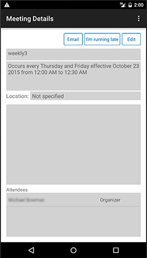

# Application Interop REST Mail Contacts Calendar

Ce projet a adopté le [code de conduite Microsoft Open Source](https://opensource.microsoft.com/codeofconduct/). Pour plus d’informations, reportez-vous à la [FAQ relative au code de conduite](https://opensource.microsoft.com/codeofconduct/faq/) ou contactez [opencode@microsoft.com](mailto:opencode@microsoft.com) pour toute question ou tout commentaire.

Cet exemple d’application illustre l’interface REST pour Office 365, y compris l’authentification, l’interaction avec le calendrier, l’interrogation du carnet d’adresses et l’envoi de messages électroniques. L’application peut être créée pour Android et pour la plateforme Windows universelle. Pour commencer, [inscrivez votre application avec un compte de développeur Office 365](#inscrivez-votre-application-avec-un-compte-de-développeur-office-365), puis choisissez les plateformes que vous voulez créer. 

##Table des matières

* [À propos de l’application Interop REST Mail Contacts Calendar](#à-propos-de-lapplication-interop-rest-mail-contacts-calendar)

* [Inscription de l’application avec un compte de développeur Office 365](#inscription-de-lapplication-avec-un-compte-de-développeur-office-365)

* Création de l’application

  * [Création de l’application pour la plateforme Windows universelle](/UWP)
  
  * [Création de l’application pour Android](/Android)

##À propos de l’application Interop REST Mail Contacts Calendar

Dans l’application, une fois connecté à un compte Office 365, vous pouvez afficher votre calendrier et créer des réunions ponctuelles ou périodiques dans votre calendrier. Les réunions peuvent être planifiées avec un lieu spécifique, un créneau horaire et un ensemble d’invités, où les lieux disponibles et les participants sont interrogés à partir d’Office 365. Chaque invité a la possibilité d’accepter, de refuser ou d’accepter provisoirement une réunion ou d’envoyer un e-mail à l’organisateur. Un organisateur a la possibilité de répondre à tous ou de transférer l’invitation à la réunion et d’envoyer un message aux invités en cas de retard.

Si l’application est générée avec la plateforme Windows universelle, vous pouvez visualiser les demandes et réponses en direct de l’API Microsoft Graph Universal dans une console en bas de l’application.

L’application de base vous permet d’effectuer les opérations suivantes :

####Afficher votre calendrier

Android | UWP
--- | ---
 | 

####Afficher les détails de la réunion

Android | UWP
--- | ---
 | 

####Envoyer un message à d’autres participants à la réunion

Android | UWP
--- | ---
 | 

####Modifier les détails de la réunion

Android | UWP
--- | ---
 | 

####Créer une réunion

Android | UWP
--- | ---
 | 

##Inscription de l’application avec un compte de développeur Office 365

1. Quoi que vous utilisiez pour configurer votre application, vous devez posséder un compte de développeur Office 365 et inscrire votre application avec celui-ci. Pour vous inscrire à un compte de développeur Office 365 :

  * [Participez au programme pour les développeurs Office 365 et obtenez un abonnement gratuit d’un an à Office 365](https://aka.ms/devprogramsignup).

  * Suivez le lien contenu dans le message de confirmation et créez un compte de développeur Office 365.

  * Pour obtenir des instructions détaillées sur l’inscription à un compte de développeur, cliquez [ici](https://msdn.microsoft.com/en-us/library/office/fp179924.aspx#o365_signup).

2. Une fois que vous avez créé un compte de développeur Office 365, accédez à [graph.microsoft.io](http://graph.microsoft.io/en-us/) pour inscrire votre application et cliquez sur **Inscription de l’application**, puis sur **Outil d’inscription de l’application Office 365** ou accédez directement à la page d’inscription [dev.office.com/app-registration](http://dev.office.com/app-registration).

   

  

3. Donnez un nom à votre application et sélectionnez **Application native** à la ligne **Type d’application**. Ensuite, sélectionnez un URI de redirection. La convention d’affectation de noms préférée est : « votre domaine Office 365 + un nom unique pour votre application », mais elle n’est pas obligatoire. Le nom doit toutefois respecter le format d’un URI et être unique. Par exemple, j’ai nommé mon application https://greencricketcreations.onmicrosoft.com/MyCalendarApp. L’URI de redirection n’est pas un site web réel ; il s’agit plus d’un identificateur unique pour votre application. Une fois que vous avez entré un nom et un URI de redirection, définissez les autorisations. Les autorisations nécessaires sont :

  * Accéder en lecture aux profils utilisateur
  * Accéder en lecture aux contacts utilisateur
  * Lire et écrire des calendriers utilisateur
  * Accéder en lecture aux calendriers utilisateur
  * Envoyer un courrier électronique en tant qu’utilisateur
  * Lire et écrire un courrier électronique d’utilisateur

4. Une fois que vous avez rempli le formulaire, cliquez sur **Inscrire l’application**.

  

5. Une fois l’inscription terminée, vous recevez un ID client. Notez l’ID client et l’URI de redirection, vous en aurez besoin pour la configuration de votre application.

6. Si vous avez besoin de plus de contrôle sur les options d’inscription, vous pouvez suivre ces [instructions détaillées](https://github.com/jasonjoh/office365-azure-guides/blob/master/RegisterAnAppInAzure.md) pour inscrire votre application dans Azure. Notez que les instructions ci-après utilisent le portail classique Azure. Vous pouvez accéder au [portail classique Azure ici](https://manage.windowsazure.com/).

7. Vous êtes maintenant prêt à créer votre application avec [Android](/Android), la [plateforme Windows universelle](/UWP) ou les deux.

---

###Copyright

Copyright (c) 2016 Microsoft. Tous droits réservés.