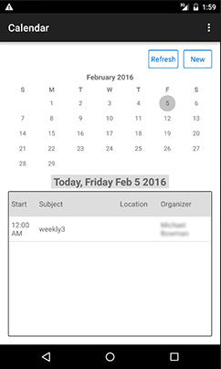
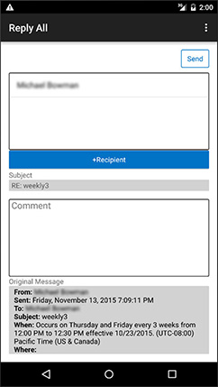
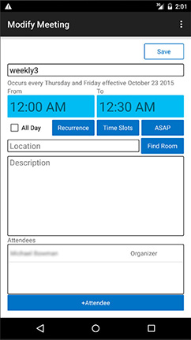
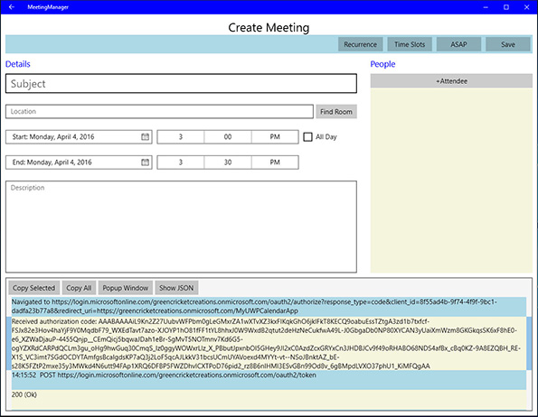
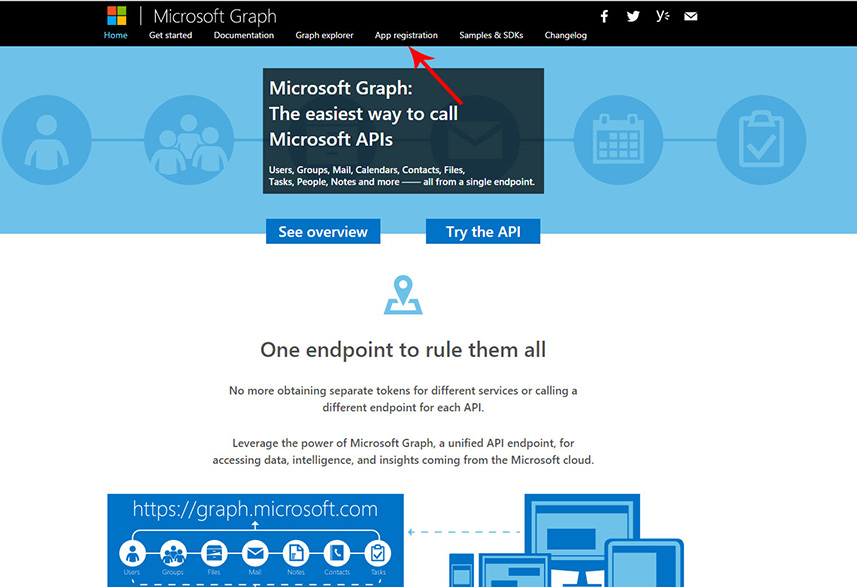
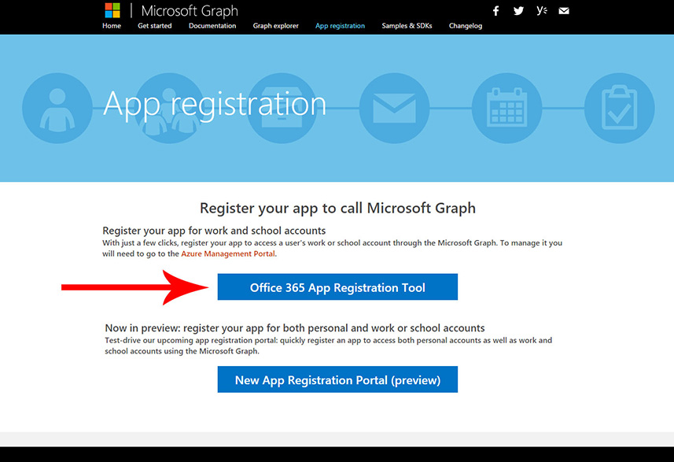

# Interop REST Mail Contacts Calendar アプリ

このプロジェクトでは、[Microsoft Open Source Code of Conduct](https://opensource.microsoft.com/codeofconduct/) が採用されています。詳細については、「[規範に関する FAQ](https://opensource.microsoft.com/codeofconduct/faq/)」を参照してください。または、その他の質問やコメントがあれば、[opencode@microsoft.com](mailto:opencode@microsoft.com) までにお問い合わせください。

この例のアプリでは、認証、予定表との対話式操作、アドレス帳の照会、およびメールの送信など、Office 365 用の Representational State Transfer (REST) インターフェイスを説明します。 アプリは、Android とユニバーサル Windows プラットフォーム用に構築できます。 使用を開始するには、[Office 365 開発者アカウントにアプリを登録し](#office-365-開発者アカウントにアプリを登録し)、構築するプラットフォームを選択します。 

##目次

* [Interop REST Mail Contacts Calendar アプリについて](#interop-rest-mail-contacts-calendar-アプリについて)

* [アプリを Office 365 開発者アカウントで登録する](#アプリを-office-365-開発者アカウントで登録する)

* アプリの構築

  * [ユニバーサル Windows プラットフォーム用のアプリを構築する](/UWP)
  
  * [Android 用のアプリを構築する](/Android)

##Interop REST Mail Contacts Calendar アプリについて

アプリでは、Office 365 アカウントにログインすると、予定表が表示され、予定表に 単独の会議または定期的な会議を作成できます。 会議には、指定された場所、時間帯、および招待された人のセットをスケジュールでき、利用可能な場所と出席者は、Office 365 から照会します。 招待された人にはそれぞれ、会議を承諾、拒否、仮承諾するオプション、または開催者にメールを送信するオプションがあります。 開催者には、全員に返信する、会議出席依頼を転送する、および招待された人に開催遅延メッセージを送信するオプションがあります。

アプリをユニバーサル Windows プラットフォームで構築している場合は、アプリの下部にあるコンソールの Microsoft Graph ユニバーサル API からライブの要求と応答を確認できます。

基本的なアプリでは次のことができます:

####予定表の表示

Android | UWP
--- | ---
 | 

####会議の詳細の表示

Android | UWP
--- | ---
 | 

####他の会議参加者にメッセージを送信する

Android | UWP
--- | ---
 | 

####会議の詳細の変更

Android | UWP
--- | ---
 | 

####新しい会議の作成

Android | UWP
--- | ---
 | 

##アプリを Office 365 開発者アカウントで登録する

1. アプリの構成に何を使用していても、Office 365 開発者アカウントを取得して、それにアプリを登録する必要があります。 Office 365 の開発者アカウントにサインアップするには:

  * [Office 365 Developer プログラムに参加して、Office 365 の 1 年間無料のサブスクリプションを取得します](https://aka.ms/devprogramsignup)。

  * 確認のメールに記載されたリンクに従って、Office 365 の開発者アカウントを作成します。

  * 開発者アカウントへのサインアップ手順の詳細については、[こちら](https://msdn.microsoft.com/en-us/library/office/fp179924.aspx#o365_signup)を参照してください。

2. Office 365 Developer アカウントを作成したら、アプリを登録するための [graph.microsoft.io](http://graph.microsoft.io/en-us/) に移動して、**[アプリの登録]**、**[Office 365 アプリ登録ツール]** の順にクリックします。または登録ページ [dev.office.com/app-registration](http://dev.office.com/app-registration) に直接移動することもできます。

   

  

3. アプリに名前を付けて、**[アプリの種類]** で **[ネイティブ アプリ]** を選択します。 リダイレクト URI を選択します。推奨される名前付け規則は "Office 365 ドメイン + アプリの一意の名前" ですが必須ではありません。ただし、URI の形式で設定し、一意である必要があります。 たとえば、アプリに https://greencricketcreations.onmicrosoft.com/MyCalendarApp という名前を付けます。 リダイレクト URI は実際の Web サイトではなく、アプリの一意の識別子に近いものです。 名前とリダイレクト URIを入力したら、アクセス許可を設定します。 必要なアクセス許可は次のとおりです:

  * ユーザー プロファイルの読み取り
  * ユーザーの連絡先の読み取り
  * ユーザーの予定表の読み取りと書き込み
  * ユーザーの予定表の読み取り
  * ユーザーとしてのメールの送信
  * ユーザーのメールの読み取りと書き込み

4. フォームに入力したら、**[アプリの登録]** をクリックします。

  

5. 登録が完了すると、クライアント ID が通知されます。 クライアント ID とリダイレクト URI をメモしておきます。これらはアプリを構成するために必要になります。

6. 登録オプションの詳細な制御が必要な場合は、こちらの[詳細手順](https://github.com/jasonjoh/office365-azure-guides/blob/master/RegisterAnAppInAzure.md)に従って、Azure でアプリを登録できます。 これらの手順では、Azure クラシック ポータルを使用することにご注意ください。 [Azure クラシック ポータルにはこちら](https://manage.windowsazure.com/)からアクセスできます。

7. これで、[Android](/Android) または[ユニバーサル Windows プラットフォーム](/UWP)、あるいはその両方でアプリを構築する準備ができました。

---

###著作権

Copyright (c) 2016 Microsoft. All rights reserved.