# Приложение для межпрограммного взаимодействия между REST, почтовыми контактами и календарем

Этот проект соответствует [правилам поведения Майкрософт, касающимся обращения с открытым кодом](https://opensource.microsoft.com/codeofconduct/). Читайте дополнительные сведения в [разделе вопросов и ответов по правилам поведения](https://opensource.microsoft.com/codeofconduct/faq/) или отправляйте новые вопросы и замечания по адресу [opencode@microsoft.com](mailto:opencode@microsoft.com).

На примере этого приложения демонстрируется интерфейс передачи репрезентативного состояния (REST) для Office 365, в том числе такие операции, как проверка подлинности, взаимодействие с календарем, отправка запросов в адресную книгу и отправка сообщений электронной почты. Приложение можно собрать для Android и универсальной платформы Windows. Для начала [зарегистрируйте приложение с помощью учетной записи Office 365 для разработчиков](#зарегистрируйте-приложение-с-помощью-учетной-записи-office-365-для-разработчиков), а затем выберите необходимые платформы. 

##Содержание

* [Сведения о приложении для межпрограммного взаимодействия между REST, почтовыми контактами и календарем](#Сведения-о-приложении-для-межпрограммного-взаимодействия-между-rest,-почтовыми-контактами-и-календарем)

* [Регистрация приложения с помощью учетной записи Office 365 для разработчиков](#Регистрация-приложения-с-помощью-учетной-записи-office-365-для-разработчиков)

* Сборка приложения

  * [Сборка приложения для универсальной платформы Windows](/UWP)
  
  * [Сборка приложения для Android](/Android)

##Сведения о приложении для межпрограммного взаимодействия между REST, почтовыми контактами и календарем

После входа в учетную запись Office 365 в приложении можно просматривать календарь и создавать однократные или повторяющиеся встречи в календаре. Для собраний можно планировать заданное расположение, период времени и набор приглашенных пользователей. При этом доступные расположения и участники запрашиваются из Office 365. Каждый приглашенный пользователь может принять, отклонить или предварительно принять собрание, а также отправить сообщение электронной почты организатору. Организатор может ответить всем пользователям или переслать приглашение на собрание, а также отправить приглашенным пользователям сообщение об опоздании.

Если приложение собрано с помощью универсальной платформы Windows, вы сможете просматривать запросы и ответы в режиме реального времени из универсального API Microsoft Graph в консоли в нижней части приложения.

Базовое приложение позволяет выполнять перечисленные ниже действия.

####Просмотр календаря

Android | UWP
--- | ---
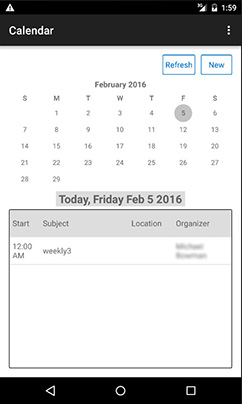 | 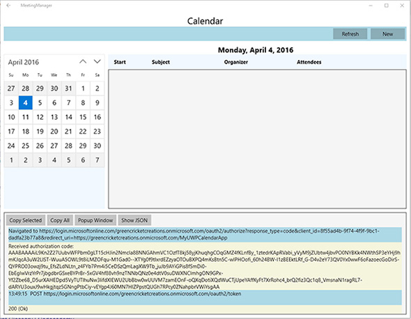

####Просмотр сведений о собрании

Android | UWP
--- | ---
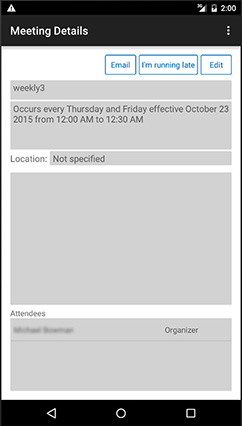 | 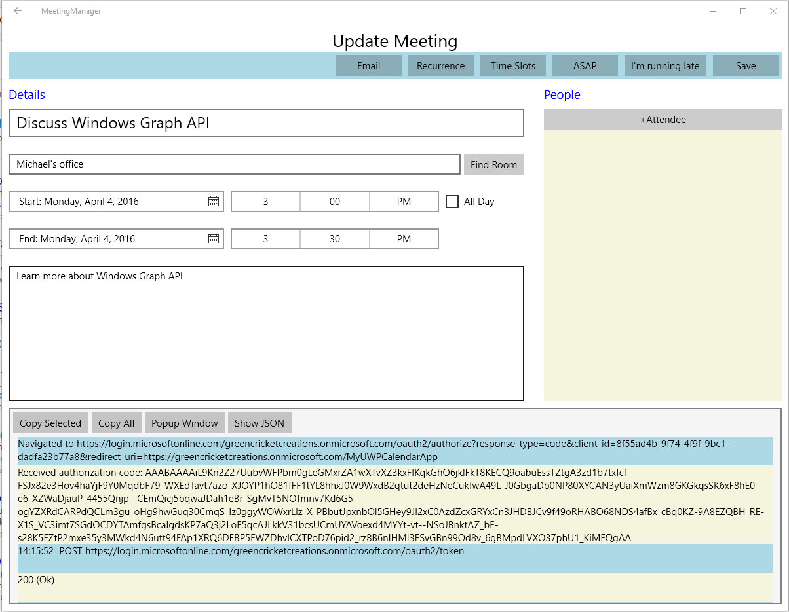

####Отправка сообщения другим участникам собрания

Android | UWP
--- | ---
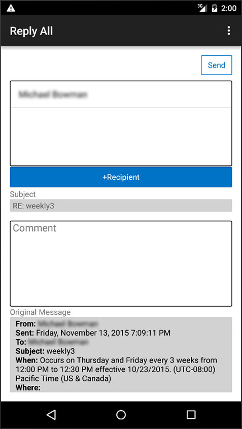 | 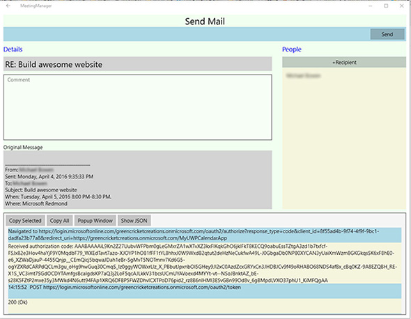

####Изменение сведений о собрании

Android | UWP
--- | ---
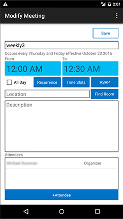 | 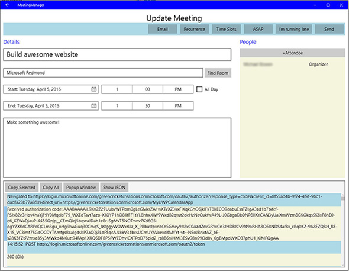

####Создание собрания

Android | UWP
--- | ---
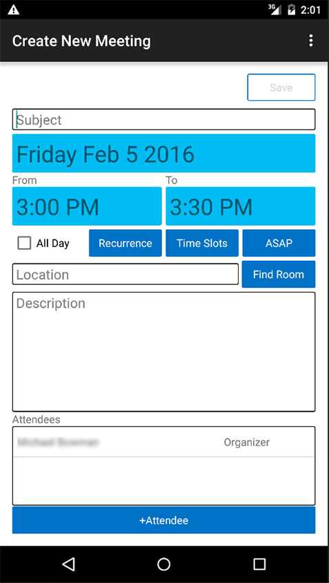 | 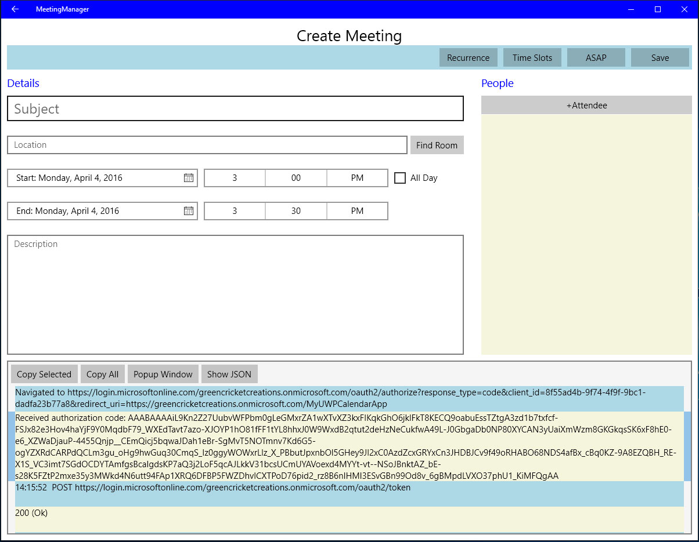

##Регистрация приложения с помощью учетной записи Office 365 для разработчиков

1. Независимо от того, что используется для настройки приложение, вам потребуется зарегистрировать свое приложение с помощью учетной запись Office 365 для разработчиков. Чтобы подписаться на учетную запись Office 365 для разработчиков, выполните приведенные ниже действия.

  * [Присоединитесь к программе Office 365 для разработчиков и получите бесплатную подписку на Office 365 сроком на 1 год](https://aka.ms/devprogramsignup).

  * Перейдите по ссылке в сообщении электронной почты с подтверждением и создайте учетную запись Office 365 для разработчиков.

  * Подробные инструкции по подписке на учетную запись для разработчиков см. [здесь](https://msdn.microsoft.com/en-us/library/office/fp179924.aspx#o365_signup).

2. Создав учетную запись Office 365 для разработчиков, перейдите по адресу [graph.microsoft.io](http://graph.microsoft.io/en-us/), чтобы зарегистрировать свое приложение, и последовательно щелкните **Регистрация приложения** и **Средство регистрации приложений Office 365**. Также можно перейти непосредственно на страницу регистрации по адресу [dev.office.com/app-registration](http://dev.office.com/app-registration).

  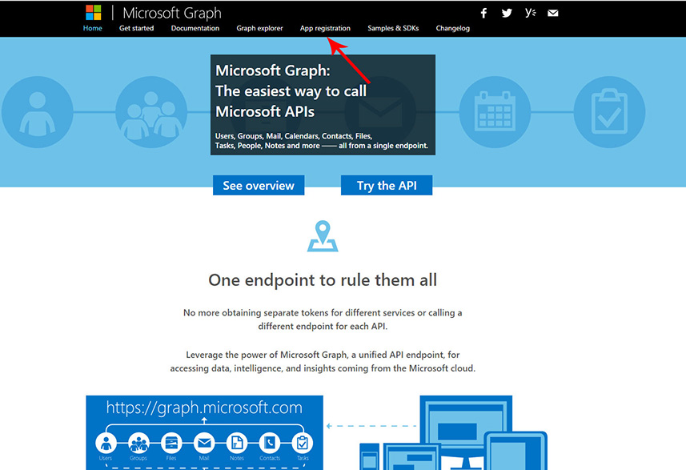 

  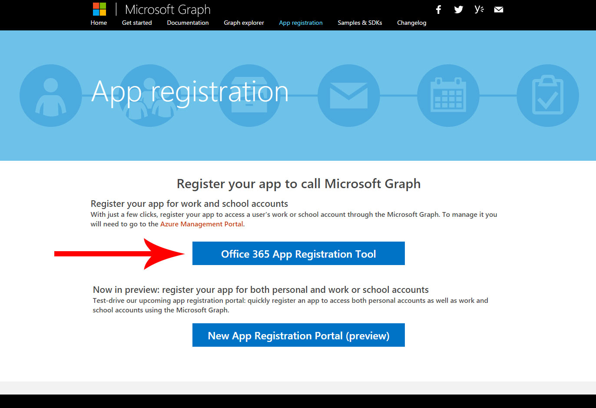

3. Присвойте приложению имя и выберите пункт **Собственное приложение** в строке **Тип приложения**. Затем выберите универсальный код ресурса (URI) перенаправления. Предпочтительно (но необязательно) использовать формат имени "домен Office 365 + уникальное имя приложения", но при этом требуется указать уникальное имя, отформатированное как универсальный код ресурса (URI). Например, я присвоил своему приложению имя https://greencricketcreations.onmicrosoft.com/MyCalendarApp. Универсальный код ресурса (URI) перенаправления — не настоящий веб-сайт. Это скорее уникальный идентификатор приложения. После ввода имени и URI перенаправления задайте разрешения. Ниже приведены необходимые разрешения.

  * Чтение профилей пользователя
  * Чтение контактов пользователя
  * Чтение и запись календарей пользователя
  * Чтение календарей пользователя
  * Отправка почты от имени пользователя
  * Чтение и создание писем от имени пользователя

4. Заполнив форму, нажмите кнопку **Зарегистрировать приложение**.

  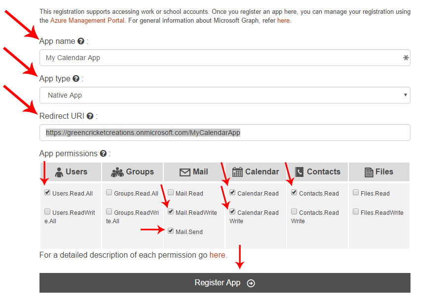

5. По завершении регистрации вы получите идентификатор клиента. Запишите идентификатор клиента и URI перенаправления. Они потребуются для настройки приложения.

6. Если вам нужен дополнительный контроль над параметрами регистрации, зарегистрируйте приложение в Azure согласно этим [подробным инструкциям](https://github.com/jasonjoh/office365-azure-guides/blob/master/RegisterAnAppInAzure.md). Обратите внимание, что эти инструкции распространяются на классический портал Azure. Здесь вы можете получить доступ к [классическому порталу Azure](https://manage.windowsazure.com/).

7. Теперь вы можете собрать приложение с помощью [Android](/Android) и/или [универсальной платформы Windows](/UWP)!

---

###Авторское право

(c) Корпорация Майкрософт (Microsoft Corporation), 2016. Все права защищены.