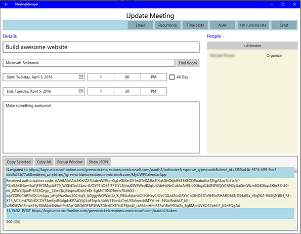

# 互操作 REST 邮件联系人日历应用

此项目采用 [Microsoft 开源行为准则](https://opensource.microsoft.com/codeofconduct/)。有关详细信息，请参阅 [Code of Conduct FAQ](https://opensource.microsoft.com/codeofconduct/faq/)（行为准则常见问题解答），有任何其他问题或意见，也可联系 [opencode@microsoft.com](mailto:opencode@microsoft.com)。

本示例应用演示 Office 365 的表述性状态转移 (REST) 接口，包括身份验证、与日历的交互、查询通讯簿以及发送电子邮件。 可为 Android 和通用 Windows 平台生成此应用。 若要开始，请 [使用 Office 365 开发人员帐户注册你的应用](#使用-office-365-开发人员帐户注册你的应用)，然后选择要为其生成应用的平台。 

##目录

* [关于互操作 REST 邮件联系人日历应用](#关于互操作-rest-邮件联系人日历应用)

* [使用 Office 365 开发人员帐户注册应用](#使用-office-365-开发人员帐户注册应用)

* 生成应用

  * [生成适用于通用 Windows 平台的应用](/UWP)
  
  * [生成适用于 Android 的应用](/Android)

##关于互操作 REST 邮件联系人日历应用

在应用中，登录 Office 365 帐户后，你可以查看你的日历以及在日历上创建单个会议或定期会议。 可以通过给定位置、时隙和一组被邀请者来安排会议，并可从 Office 365 查询可用位置和与会者。 每个被邀请者都可以选择接受会议、拒绝会议或暂时接受会议，或者向组织者发送电子邮件。 组织者可以选择全部答复，或转发会议邀请，并将会议延期邮件发送给被邀请者。

如果使用通用 Windows 平台生成应用，那么将能够在应用底部的控制台中看到来自 Microsoft Graph 通用 API 的实时请求和响应。

基本应用能够执行以下操作：

####查看你的日历

Android | UWP
--- | ---
 | 

####查看会议详细信息

Android | UWP
--- | ---
 | 

####将邮件发送给其他与会者

Android | UWP
--- | ---
 | 

####修改会议详细信息

Android | UWP
--- | ---
 | 

####新建会议

Android | UWP
--- | ---
 | 

##使用 Office 365 开发人员帐户注册应用

1. 无论你使用什么内容来配置应用，都需要拥有 Office 365 开发人员帐户，并通过该帐户注册你的应用。 要注册 Office 365 开发人员帐户，请执行以下操作：

  * [参加 Office 365 开发人员计划并获取为期 1 年的免费 Office 365 订阅](https://aka.ms/devprogramsignup)。

  * 请按照确认电子邮件中的链接进行操作，并创建 Office 365 开发人员帐户。

  * 有关注册开发人员帐户的详细说明，请转到 [此处](https://msdn.microsoft.com/en-us/library/office/fp179924.aspx#o365_signup)。

2. 在创建 Office 365 开发人员帐户后，请转到 [graph.microsoft.io](http://graph.microsoft.io/en-us/) 注册应用并单击“**应用注册**”，然后单击“**Office 365 应用注册工具**”，或者你也可以直接转到注册页 [dev.office.com/app-registration](http://dev.office.com/app-registration)。

   

  

3. 为你的应用命名并在“**应用类型**”行中选择“**本机应用**”。 然后选取一个重定向 URI，首选的命名约定为：“你的 Office 365 域 + 应用的唯一名称”，这不是必需的，但是必须将格式设置成一个 URI 并且是唯一的。 例如，我将应用命名为 https://greencricketcreations.onmicrosoft.com/MyCalendarApp。 重定向 URI 不是真实的网站；而是你的应用的唯一标识符。 在输入名称和重定向 URI 后，请设置权限。 必需的权限是：

  * 读取用户个人资料
  * 读取用户联系人
  * 读取和写入用户日历
  * 读取用户日历
  * 以用户身份发送邮件
  * 读取和编写用户邮件

4. 在填写表单后，请单击“**注册应用**”。

  

5. 完成注册后，你将收到一个客户端 ID。 请记下客户端 ID 和重定向 URI，你将需要使用它们来配置应用。

6. 如果需要进一步控制注册选项，则可以按照这些 [详细说明](https://github.com/jasonjoh/office365-azure-guides/blob/master/RegisterAnAppInAzure.md) 来在 Azure 中注册你的应用。 请注意，这些说明使用 Azure 经典门户。 你可以访问 [Azure 经典门户](https://manage.windowsazure.com/)。

7. 现在，你可以使用 [Android](/Android) 或 [通用 Windows 平台](/UWP) 或这两者来生成应用！

---

###版权

版权所有 (c) 2016 Microsoft。保留所有权利。