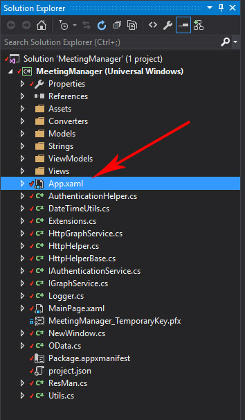
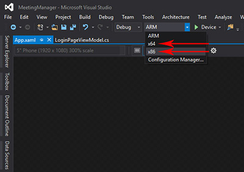
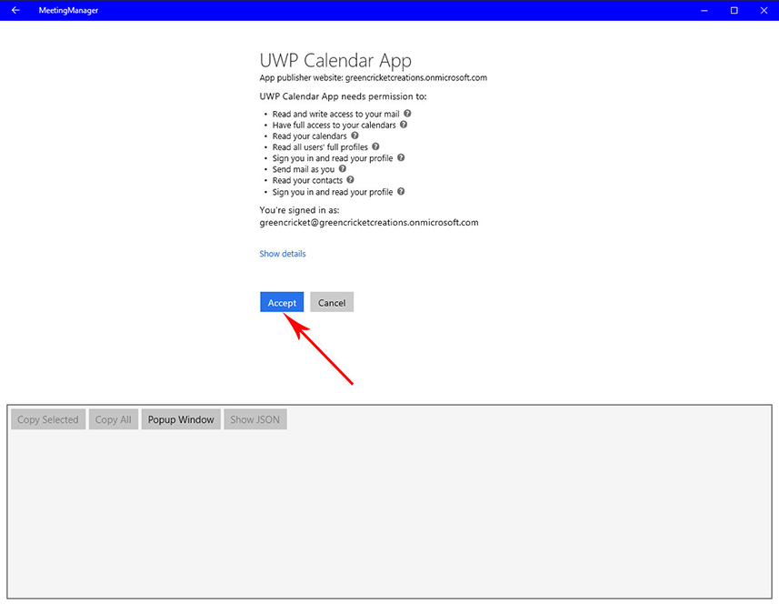
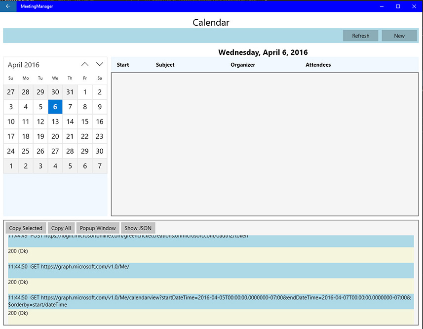

# Interop REST Mail Contacts Calendar App for the Universal Windows Platform

The Universal Windows Platform allows developers to build their apps for a wide range of devices including mobile, desktop, HoloLens, Surface Hub, and Xbox. You can learn more about the Universal Windows Platform on the [UWP Quick Start Guide](http://microsoft.github.io/UWPQuickStart/index.html#). 

Before you begin, you need to [register your app with an Office 365 Developer account](../README.md#register-the-app-with-an-office-365-developer-account).

##Table of Contents

* [Register the App with Office 365 Developer Account](../README.md#register-the-app-with-an-office-365-developer-account)

* [Install Visual Studio](#install-visual-studio)

* [Windows UWP Configuration](#windows-uwp-configuration)

##Install Visual Studio

In order to build the app for the Universal Windows Platform, you need to install Visual Studio 2015 Community (free) or Enterprise (paid). You can download Visual Studio 2015 Community or Enterprise from the [Visual Studio Website](https://www.visualstudio.com/).

##Windows UWP Configuration

1. Download or clone The Interop REST Mail Calendar Android App from the [GitHub repo](https://github.com/OfficeDev/Interop-REST-Mail-Contacts-Calendar-Sample).

2. Start Visual Studio.

3. To open the app, click File then hover over Open which will open a new menu and click Project/Solution or click Open Project... on the start page. Then navigate to the Meeting_Manager_UWP folder \Interop-REST-Mail-Contacts-Calendar-Sample\UWP\Meeting_Manager_UWP and open MeetingManager.sln:

	Open from menu | Open from start page
	--- | ---
	 | 

	#### Select MeetingManage.sln 

	

4. With the project open select App.xaml from the Solution Explorer: 

	

5. In the App.xaml file, replace the ClientID with your Client ID, replace the RedirectUri with your Redirect URI and then replace the Domain with your developer tenant domain. For example, I used "https://greencricketcreations.onmicrosoft.com/MyUWPCalendarApp" for my Redirect URI, so my developer tenant domain is "greencricketcreations.onmicrosoft.com": 

	

6. Once you have entered your app registration information, click on the Solution Platforms dropdown on the menu (it's directly left of the green arrow pointing right, see the image below) and choose either x64 or x86 depending on your system, then click on "Local Machine" next to the green arrow.

	 | 
	--- | ---

7. Once your app starts, click "Connect to Office 365" and enter your login info from your Office 365 Developer Account then click accept on the next page:

	 |  | 
	--- | --- | ---

8. Your app is now ready to go. You can see the requests and responses from the Microsoft Graph API on the bottom of your screen.

	

9. Your app is now running on the Microsoft Universal Platform, go make something great!

---

###Copyright

Copyright (c) 2016 Microsoft. All rights reserved.
