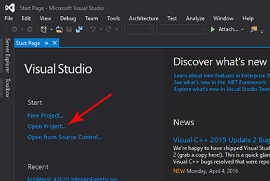

# Interop REST Mail Contacts Calendar App for the Universal Windows Platform

The Universal Windows Platform allows developers to build their apps for a wide range of devives including mobile, desktop, HoloLens, Surface Hub and Xbox. You can learn more about the Universal Windows Platform on the [UWP Quick Start Guide](http://microsoft.github.io/UWPQuickStart/index.html#). 

##Table of Contents

* [Register the App with Office 365 Developer Account](../#register-the-app-with-office-365-developer-account)

* [Install Visual Studio](#install-visual-studio)

##Install Visual Studio

In order to build the app for the Universal Windows Platform, you need to install Visual Studio 2015 Community (free) or Enterprise (paid). You can download Visual Studio 2015 Community or Enterprise from the [Visual Studio Website](https://www.visualstudio.com/).

##Windows UWP Platform

1. Download or clone The Interop REST Mail Calendar Android App from the [GitHub repo](https://github.com/OfficeDev/Interop-REST-Mail-Contacts-Calendar-Sample).

2. Start Visual Studio.

3. To open the app, click File then hover over Open which will open a new menu and click Project/Solution or click Open Project... on the start page:

Open from menu | Open from start page
--- | ---
 | 

---

###Copyright

Copyright (c) 2016 Microsoft. All rights reserved.